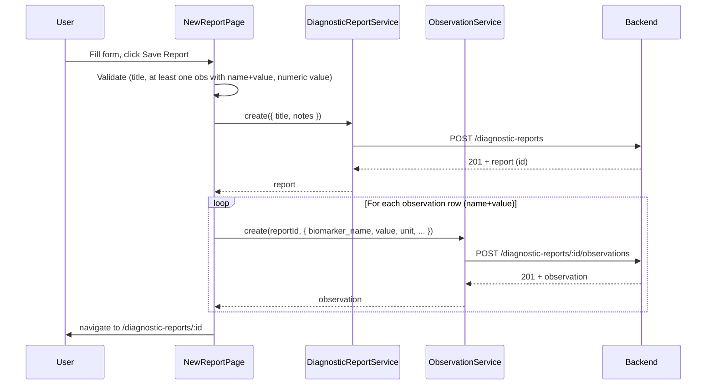

# 001 - Diagnostic Reports and Observations — API integration

---

## Context

- **Current behaviour:** [NewDiagnosticReport.tsx](src/pages/NewDiagnosticReport.tsx) validates and shows a toast then navigates; no API calls. No services exist for reports or observations. [DiagnosticReportsList.tsx](src/pages/DiagnosticReportsList.tsx) shows a static empty state.
- **API (from [docs/openapi/openapi.json](docs/openapi/openapi.json)):**  
  - Reports: `POST /diagnostic-reports`, `GET /diagnostic-reports`, `GET /diagnostic-reports/{id}`. Request body today: `notes` only; **title** will be added by backend — assume `StoreDiagnosticReportRequest` will include optional `title` and use it in types and UI.  
  - Observations: `POST /diagnostic-reports/{diagnosticReportId}/observations` with `biomarker_name`, optional `biomarker_code`, `value` (number), `unit`, optional `reference_range_min`, `reference_range_max`, `reference_unit`.
- **UX:** Save only on explicit "Save Report" button click (no auto-save on blur). After successful create, redirect to the new report’s page. Value sent as number; no strict decimal-format validation beyond numeric conversion.

---

## 1. API types ([src/types/api.ts](src/types/api.ts))

Add types aligned with OpenAPI (and extended for `title` until spec is updated):

- **DiagnosticReportResource:** `id`, `notes`, `created_at`, `updated_at`, `observations` (array of ObservationResource). If backend adds `title`, include it.
- **ObservationResource:** `id`, `biomarker_name`, `biomarker_code`, `value`, `unit`, `reference_range_min`, `reference_range_max`, `reference_unit`, `created_at`, `updated_at`.
- **StoreDiagnosticReportRequest:** `notes` (optional), `title` (optional) — use in UI and request.
- **StoreObservationRequest:** `biomarker_name`, `biomarker_code` (optional), `value` (number), `unit`, `reference_range_min`, `reference_range_max`, `reference_unit` (all optional except name, value, unit).

Add list response type for `GET /diagnostic-reports`: e.g. `{ data: DiagnosticReportResource[] }`.

---

## 2. API services

**New file: [src/api/services/diagnosticReportService.ts**](src/api/services/diagnosticReportService.ts)

- `list(): Promise<{ data: DiagnosticReportResource[] }>` — `GET /diagnostic-reports`
- `get(id: number): Promise<DiagnosticReportResource>` — `GET /diagnostic-reports/{id}`
- `create(data: StoreDiagnosticReportRequest): Promise<DiagnosticReportResource>` — `POST /diagnostic-reports`

**New file: [src/api/services/observationService.ts**](src/api/services/observationService.ts)

- `create(diagnosticReportId: number, data: StoreObservationRequest): Promise<ObservationResource>` — `POST /diagnostic-reports/{diagnosticReportId}/observations`

Use the existing [src/api/client.ts](src/api/client.ts) (`api.get`, `api.post`) and handle 401/422 via existing `ApiClientError` pattern. Export both services from [src/api/index.ts](src/api/index.ts).

---

## 3. New Diagnostic Report page — form and create flow

**File: [src/pages/NewDiagnosticReport.tsx**](src/pages/NewDiagnosticReport.tsx)

- **Form model vs API:**
  - Keep **Report Title** and **Notes**; send both in create payload (title once API supports it; if spec not updated yet, send title in request and document that backend will add the field).
  - **Observations:** Replace single "Reference Range" with **reference_range_min**, **reference_range_max**, and **reference_unit** (optional). Keep **name** → `biomarker_name`, **value** → numeric `value`, **unit** → `unit`. Leave `biomarker_code` empty (no UI field).
- **Submit (explicit save only):**
  - On "Save Report" (form submit): call `diagnosticReportService.create({ title, notes })`, then for each observation with at least name + value: call `observationService.create(reportId, { biomarker_name, value: Number(value), unit, reference_range_min, reference_range_max, reference_unit })`. Parse min/max as numbers (empty → null). Do not trigger save on blur.
  - Loading: disable submit button and show loading state while requests are in flight to prevent double submit.
  - On success: `navigate(\`/diagnostic-reports/${report.id})`.
  - On 4xx: show error toast; use `ApiClientError#getFirstError()` or field errors for message. Do not navigate.
- **Validation:** Require at least one observation with name and value; value must be a valid number (for API). No extra decimal-format rule beyond numeric conversion.

---

## 4. Report list page — connect to API

**File: [src/pages/DiagnosticReportsList.tsx**](src/pages/DiagnosticReportsList.tsx)

- Use React Query: `useQuery` to call `diagnosticReportService.list()`.
- Show loading and error states; render list of reports (e.g. card or table with id, title/notes, date; link to `/diagnostic-reports/:id`).
- Keep existing empty state when `data.data.length === 0`, with "New Report" CTA.
- Ensure "New Report" button still navigates to `/diagnostic-reports/new`.

---

## 5. Report detail page (new)

**New file: [src/pages/DiagnosticReportDetail.tsx**](src/pages/DiagnosticReportDetail.tsx) (or similar name)

- Route: `/diagnostic-reports/:id`.
- Fetch report with `diagnosticReportService.get(Number(id))` (e.g. via `useQuery`). Handle loading and 404 (navigate to list or show not-found).
- Display report fields (title, notes, dates) and list of observations (read-only). No edit UI (creation only per scope).
- Add to router in [src/App.tsx](src/App.tsx): `<Route path="/diagnostic-reports/:id" element={<DiagnosticReportDetail />} />`.

---

## 6. Flow summary

---

## 7. Files to add or change

| Action                   | File                                                                                                           |
| ------------------------ | -------------------------------------------------------------------------------------------------------------- |
| Add types                | [src/types/api.ts](src/types/api.ts)                                                                           |
| Add service              | [src/api/services/diagnosticReportService.ts](src/api/services/diagnosticReportService.ts) (new)               |
| Add service              | [src/api/services/observationService.ts](src/api/services/observationService.ts) (new)                         |
| Export services          | [src/api/index.ts](src/api/index.ts)                                                                           |
| Form + create + redirect | [src/pages/NewDiagnosticReport.tsx](src/pages/NewDiagnosticReport.tsx)                                         |
| List from API            | [src/pages/DiagnosticReportsList.tsx](src/pages/DiagnosticReportsList.tsx)                                     |
| New page + route         | [src/pages/DiagnosticReportDetail.tsx](src/pages/DiagnosticReportDetail.tsx) (new), [src/App.tsx](src/App.tsx) |

---

## 8. Out of scope (per requirements)

- Edit report or observations (PATCH/DELETE).
- Auto-save on blur; save only on "Save Report" click.
- Strict decimal-format validation for value (only numeric conversion for API).
- UI for `biomarker_code` (leave empty in payload).

---

**Note:** Once the backend adds `title` to the OpenAPI spec, update [src/types/api.ts](src/types/api.ts) and any request/response types to match the new schema.